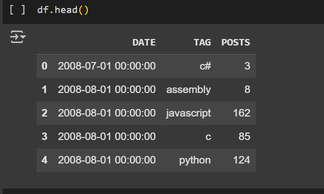
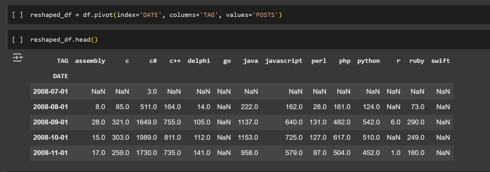
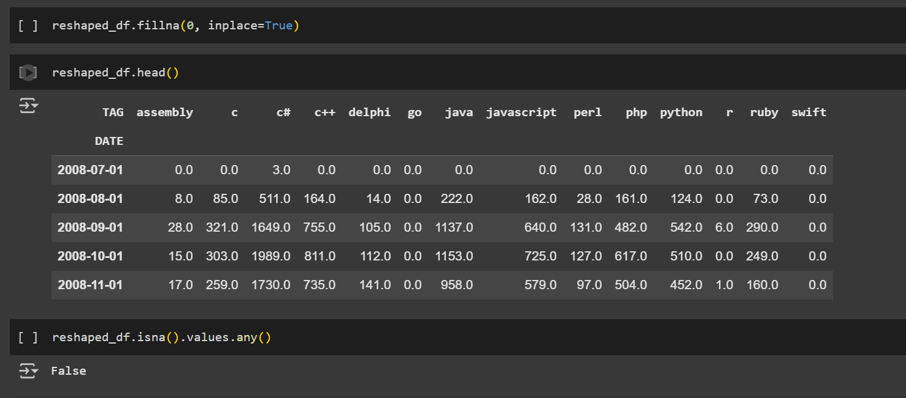
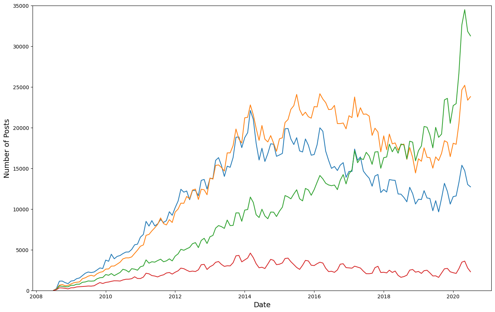
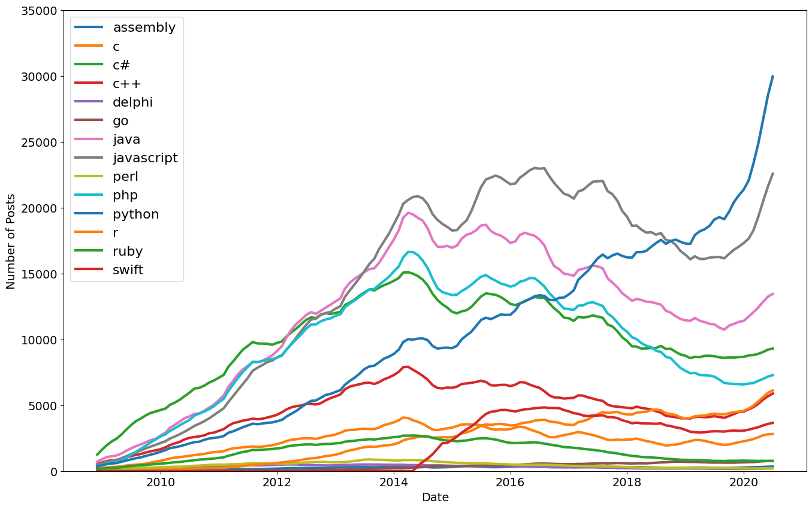

# Programming Language Popularity Analysis

[](https://www.python.org/)
[](https://pandas.pydata.org/)
[](https://matplotlib.org/)

This project involves analyzing the popularity of various programming languages over time by processing and visualizing data. The dataset contains information about posts related to different programming languages, and the goal is to reshape, clean, and plot the data to identify trends.

## Features

- **Data Preprocessing**:
  - Reading a CSV file with programming language posts and reshaping it to analyze trends.
  - Cleaning data by handling missing values.
  - Manipulating the data to examine the relationship between programming languages and their popularity over time.

- **Data Visualization**:
  - Plotting the number of posts for each programming language across different dates.
  - Applying a rolling mean to smooth out time series data and make trends more apparent.

- **Data Export**:
  - Saving the reshaped data and rolling mean data to CSV files for further use.

## Steps

### 1. Reading the CSV File
The script begins by reading the dataset `QueryResults.csv`. The columns are renamed to more meaningful names: `DATE`, `TAG`, and `POSTS`. The data is then loaded into a pandas DataFrame for easy manipulation.



### 2. Data Preprocessing

- **Datetime Conversion**:
  - The `DATE` column, initially in string format, is converted to a datetime type to allow for proper time-based analysis.

- **Reshaping the Data**:
  - The data is pivoted, with dates as rows and programming language tags as columns, displaying the number of posts for each language over time.
 
   

- **Data Cleaning**:
  - Missing values (`NaN`) are replaced with zeros to ensure that the data is complete and ready for analysis.

   


### 3. Data Visualization

- A line chart is generated to plot the number of posts for each programming language over time.
  
- Each language is represented by a separate line on the chart, allowing for easy comparison of their popularity.
  

### 4. Smoothing Time Series Data

- **Rolling Mean**:
  - To reduce the noise in the data, a rolling mean is applied. This technique smooths the time series data by averaging posts over a window of 6 periods (e.g., days, weeks, etc.).
  - The smoothed data is then plotted on a second graph for a clearer view of the trends.
 

### 5. Saving Data

- The reshaped data is saved to a new CSV file (`reshaped_data.csv`).
- The rolling mean data is also saved to a separate CSV file (`rolling_data.csv`) for further analysis.

## Requirements

- Python 3.x
- [pandas](https://pandas.pydata.org/)
- [matplotlib](https://matplotlib.org/)

You can install the required libraries using pip:

```bash
pip install pandas matplotlib
